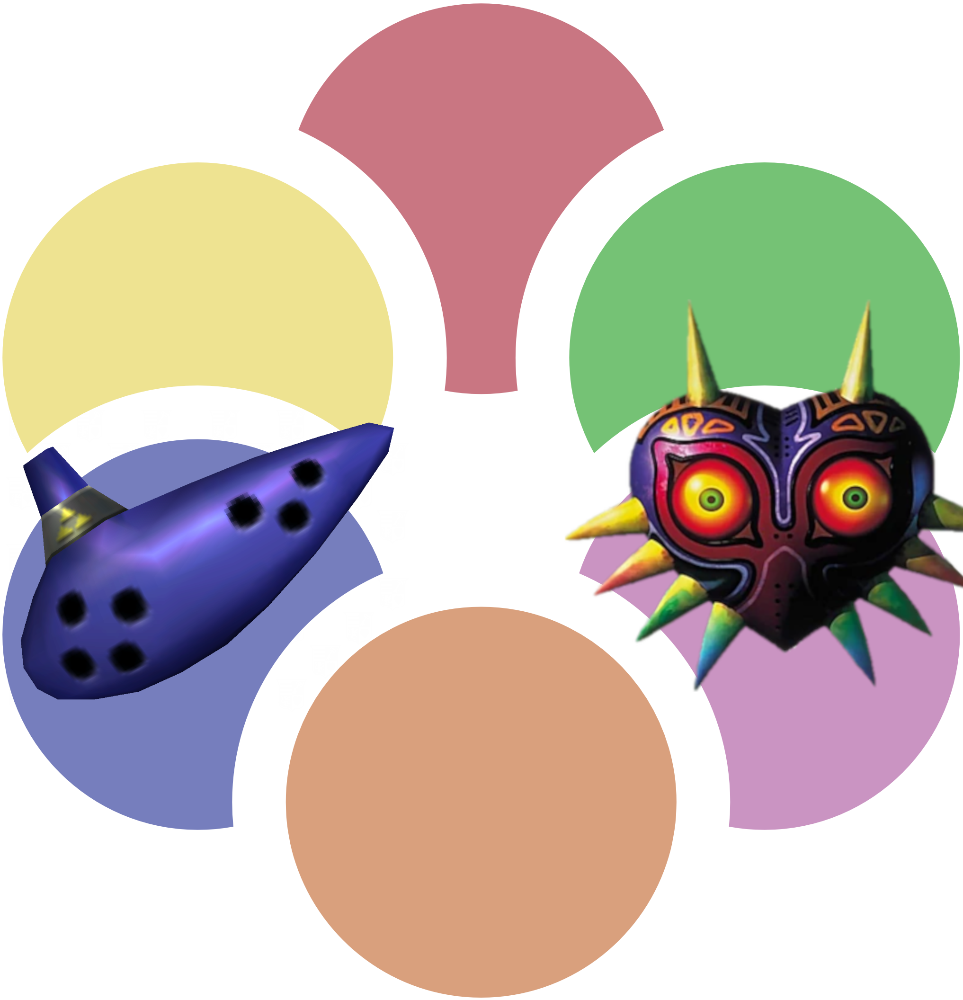

# AP-OOTMM

An Archipelago implementation of OOTMM.

Configuration files are generated from OOTMM, then processed at runtime for the Archipelago apworld.  
Once the game is generated; [Unknown how yet] the OOTMM rom is patched, and it is set up for the AP multiworld.  

## Terms you should know to make it less confusing

- **OOTMM** - The OOTMM combo rando developed by the OOTMM Dev team.
  - [OOTMM Github Link](https://github.com/OoTMM/OoTMM)
- **AP-OOTMM / OOTxMM** - The Archipelago implementation of OOTMM
  - [AP-OOTMM Github Link](https://github.com/Quasky/AP-OOTMM)  
  - AP-OOTMM is the '*public*' name of the project (everything but code)
  - OOTxMM is the internal code-name of the project (code only)

## Development

Right now:  
- Regions and Locations are generated and processed at runtime.  
- Items are static.
- Logic is unfinished.
- Options are unfinished.

Step 1 is just getting a viable product developed where the multiworld can generate and be playable as a v0.1.  

### GenerateMetadata.py
- `GenerateMetadata.py` should be the central source/process for converting OOTMM logic/data into formats used by AP-OOTMM.
    - Any data that must be compiled from OOTMM to AP-OOTMM should be processed through this script as the 'single source of conversion'  
    - All data will be output as yaml (as that's native to OOTMM), then converted into JSON for use by AP-OOTMM 

- To generate/update the json/yamls for the AP world:  
    1) Download the source of OOTMM
    2) Copy the `/packages/data/src` folder, and place it in the `/raw` folder of AP-OOTMM  
        - The final filepaths should be `/raw/src/*`...etc..etc  
    3) Running `/raw/GenerateMetadata.py` will generate the json files that are processed by the APworld

## TODO

|Task|Static?|Dynamic?|Done?|
|-----|-----|-----|-----|
|AP - World|x|x||
|AP - Items|x|||
|AP - Locations|x|x||
|AP - Regions|x|x||
|AP - Rules||||
|AP - Options||||
|Game - Generator/Patch||||
|AP - Setup page|x|x||
|AP - Game page|x|x||

- Misc Tasks:
  - Get license permissions for OOTMM properly (ask them how they'd like to deal with it really)
  - Make a proper logo for github/discord.

## Special Thanks

Thank you to [Fletch64](https://github.com/Fletch64) and [alphaONE2](https://github.com/alphaONE2) for their work on the first pass at an OOTMM AP world/generator.  

Thank you to the [OOTMM Dev Team](https://github.com/OoTMM/OoTMM) for creating OOTMM in the first place.

Thank you to the Archipelago contribution community for continuing to make something awesome.  